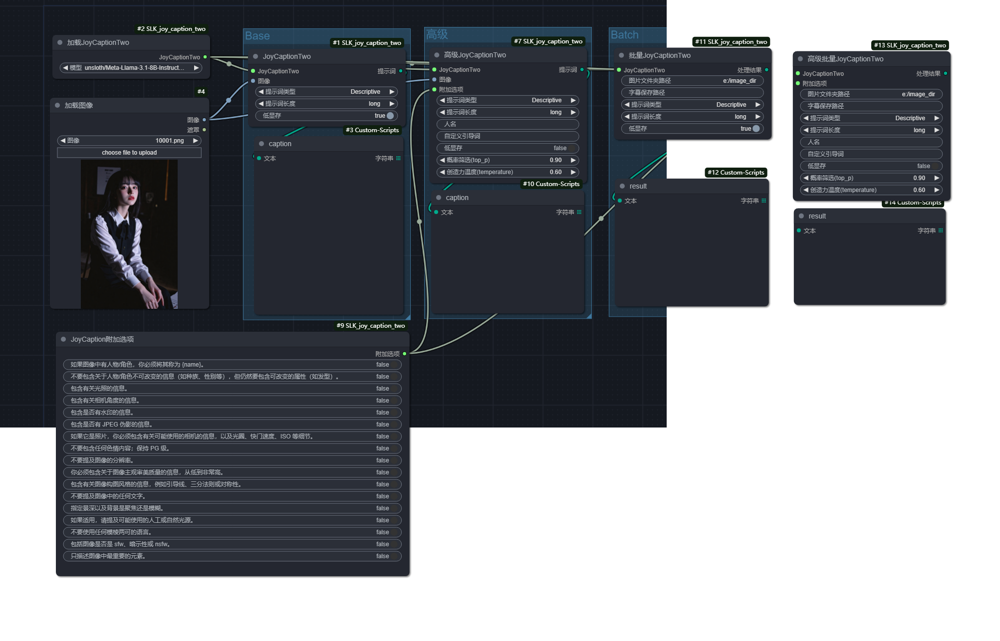
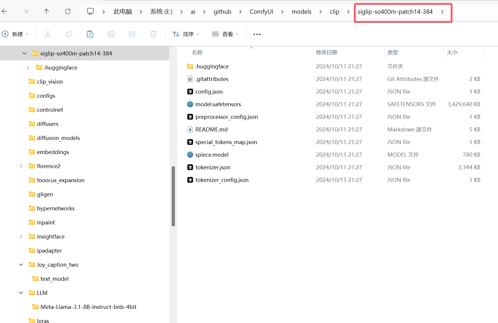
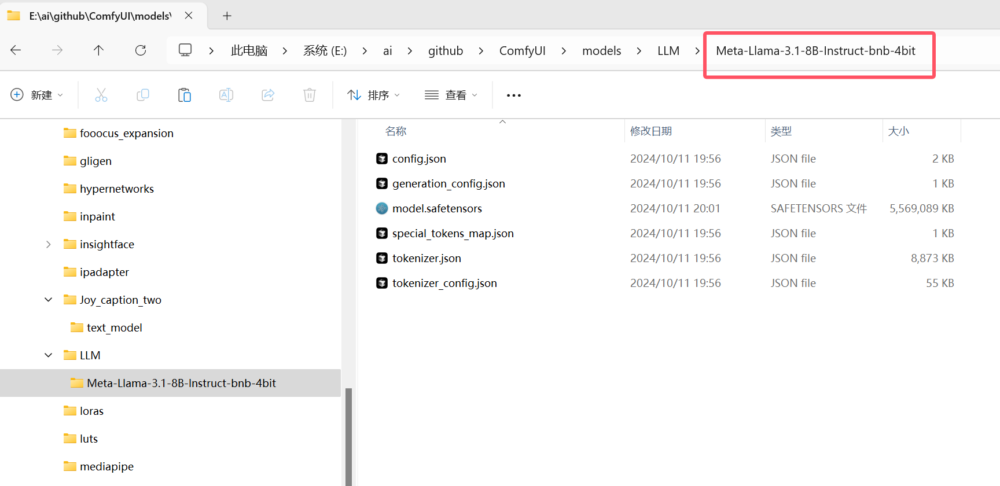
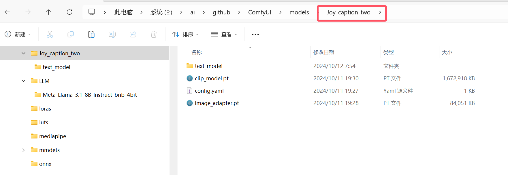

# JoyCaptionAlpha Two for ComfyUI
English | [中文](./readme.md)

Huge thanks to the original Joy Caption author, fpgaminer, whose work is available at: https://github.com/fpgaminer/joycaption. We deeply appreciate their contribution to open source!

## Recent changes
* [2024-10-22] v0.0.8: Advanced batch captioning with prefix and suffix, convenient for batch adding trigger words during training.
* [2024-10-16] v0.0.7: Unified model loading precision, fixed the bug where the model could not be switched the second time, and added a rename switch to advanced batch captioning.
* [2024-10-16] v0.0.6: Added `top_p` and `temperature` parameters to the advanced mode for greater control. Expanded the selection of large language models. I tested [John6666/Llama-3.1-8B-Lexi-Uncensored-V2-nf4](https://huggingface.co/John6666/Llama-3.1-8B-Lexi-Uncensored-V2-nf4) and found the results quite good; you can also try it out. Additionally, the original [Orenguteng/Llama-3.1-8B-Lexi-Uncensored-V2](https://huggingface.co/Orenguteng/Llama-3.1-8B-Lexi-Uncensored-V2) model has been added as an option.
* [2024-10-15] v0.0.5: Fix the bug when processing images with an alpha channel (RGBA) in batch.
* [2024-10-15] v0.0.4: Added batch processing nodes: When the output directory is empty, it will be saved in the image folder.  You can find the example workflow in the examples directory.
* [2024-10-15] v0.0.3: Fixed an issue where specifying 'cuda:0' would partially fail, now defaults to 'cuda'
* [2024-10-14] v0.0.2: Added registration to Comfy Manager, allowing for installation of this node through it. Fixed the incorrect model selection guidance; the original framework was based on unsloth/Meta-Llama-3.1-8B-Instruct instead of Meta-Llama-3.1-8B.
* [2024-10-12] v0.0.1: Basic implementation of [JoyCaptionAlpha Two](https://huggingface.co/spaces/fancyfeast/joy-caption-alpha-two) on ComfyUI is completed.


## Implementation of JoyCaptionAlpha Two on ComfyUI

Referred to [Comfyui_CXH_joy_caption](https://github.com/StartHua/Comfyui_CXH_joy_caption) and [JoyCaptionAlpha Two](https://huggingface.co/spaces/fancyfeast/joy-caption-alpha-two).

Refer to the example workflow in examples/workflows.png:


### Installation

You can install the node using Comfy Manager. Search for "JoyCaptionAlpha Two for ComfyUI" and install it.

Alternatively, you can install it manually using the following steps. Please also refer to the "Downloading Related Models" section below, especially for the Joy-Caption-alpha-two model, which must be downloaded manually.

### Dependency Installation

1. Download and clone the repository to the custom_nodes subfolder.
```
cd custom_nodes
git clone https://github.com/EvilBT/ComfyUI_SLK_joy_caption_two.git
```
2. Install related dependencies:
```
pip install -r ComfyUI_SLK_joy_caption_two\requirements.txt
```
3. Download related models.
4. Restart ComfyUI.

### Downloading Related Models
The following "models" directory refers to the models folder under the ComfyUI root directory.

#### 1. google/siglip-so400m-patch14-384:

International: [google/siglip-so400m-patch14-384](https://huggingface.co/google/siglip-so400m-patch14-384)

China: [hf/google/siglip-so400m-patch14-384](https://hf-mirror.com/google/siglip-so400m-patch14-384)

It will be downloaded automatically. You can also manually download the entire repository and copy all files inside siglip-so400m-patch14-384 to `models/clip/siglip-so400m-patch14-384`.


#### 2. Llama 3.1-8B-Instruct Model Download

Two versions are supported:

* **unsloth/Meta-Llama-3.1-8B-Instruct-bnb-4bit:** This version utilizes 4-bit quantization (bnb) and is ideal for users with limited VRAM. This is the version I personally use and recommend, especially for 8GB VRAM environments. 

* **unsloth/Meta-Llama-3.1-8B-Instruct:** This is the standard, unquantized version of the model. I have not tested it extensively, but you are welcome to try it out.

Both versions will be downloaded automatically by the program if they are not found, but you can also download them manually from the links below:

**2.1 unsloth/Meta-Llama-3.1-8B-Instruct-bnb-4bit**

* **International:** [unsloth/Meta-Llama-3.1-8B-Instruct-bnb-4bit](https://huggingface.co/unsloth/Meta-Llama-3.1-8B-Instruct-bnb-4bit)
* **China:** [hf/unsloth/Meta-Llama-3.1-8B-Instruct-bnb-4bit](https://hf-mirror.com/unsloth/Meta-Llama-3.1-8B-Instruct-bnb-4bit)

After downloading, copy the entire contents of the folder to `models\LLM\Meta-Llama-3.1-8B-Instruct-bnb-4bit`.

**2.2 unsloth/Meta-Llama-3.1-8B-Instruct**

* **International:** [unsloth/Meta-Llama-3.1-8B-Instruct](https://huggingface.co/unsloth/Meta-Llama-3.1-8B-Instruct)
* **China:** [hf/unsloth/Meta-Llama-3.1-8B-Instruct](https://hf-mirror.com/unsloth/Meta-Llama-3.1-8B-Instruct)

After downloading, copy the entire contents of the folder to `models\LLM\Meta-Llama-3.1-8B-Instruct`.



#### 3. Joy-Caption-alpha-two Model Download (must be downloaded manually)

Download and copy all the contents of the `cgrkzexw-599808` folder under [Joy-Caption-alpha-two](https://huggingface.co/spaces/fancyfeast/joy-caption-alpha-two/tree/main) to `models/Joy_caption_two`.


### After restarting ComfyUI, you can add and use it. Refer to the following images for details:


### Others

If you have installed the [AIGODLIKE-ComfyUI-Translation](https://github.com/AIGODLIKE/AIGODLIKE-ComfyUI-Translation) language pack plugin, you can copy the Chinese translation under the `translation` folder to the corresponding language pack path, and restart to use the Chinese version.
Copy `translation/zh-CN/Nodes/Comfyui_SLK_joy_caption_two.json` to the directory: `AIGODLIKE-ComfyUI-Translation\zh-CN\Nodes`.

You can open an issue to ask me if you have any questions. It has not been fully tested, I am using an 8G VRAM environment.